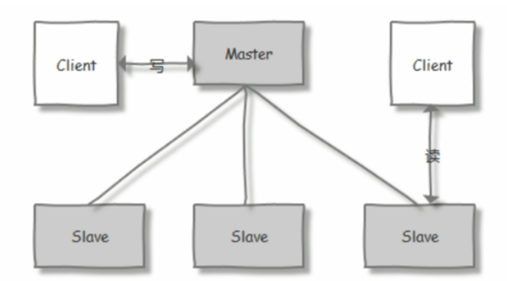

# 服务架构演变


## 单体(巨石)架构

all in one的架构方式，把所有的功能单元放在一个应用里。然后把整个应用部署到一台服务器上。如果负载能力不行，将整个应用进行 水平复制，进行扩展，然后通过负载均衡实现访问。

## MVC

MVC是模型(Model)、视图(View)、控制器(Controller)的简写，是一种软件设计规范。是将业务逻辑、数据、显示分离的方法来组织代码。

MVC主要作用是降低了视图与业务逻辑间的双向偶合。

Python的 MTV

M: Model 数据模型，负责与数据库交互， T：Template 模板展示，负责呈现内容到浏览器，一般为.html文件 V:  view 流程逻辑，负责接收请求，相当于处理中枢，获取数据（来自用户） ，经过处理后选择合适的结果返回给用户。

## SOA

SOA（Service Oriented Architecture）是由多个服务组成的分布式系统

各个子系统之间没有采用统一的通信标准,导致系统间通信与数据交互变得异常复杂

各个服务之间通过ESB(Enterprise Service Bus)进行通信,ESB是一个由大量规则和原则集成的软件架构，可以将一系列不同的应用程序集 成到单个基础架构中，由于没有好的开源方案，只能使用商业公司的产品,因此成本很高

ESB的单点依赖和商业ESB的费用问题反而成为了所有服务的瓶颈

## 微服务

微服务化的核心就是将传统的一站式应用，根据业务拆分成一个一个的服务，彻底消除强耦合，每一个微服务提供单个业务功能，一个 服务只做一件事。每个服务都围绕着具体业务进行构建，并且能够被独立地部署到生产环境、类生产环境等

服务之间采用轻量级的标准的通信机制,通常是基于HTTP的RESTful (Representational State Transfer 表述性状态转移）API

与SOA的ESB相比，微服务有开源框架，开源的核心技术

Spring Cloud Alibaba


## 服务网格 Mesh

边车代理模式Sidecar Proxy

将非业务的功能交给边车解决

服务网格 Mesh 的代表技术为**Istio,Envoy**,Linkerd,Consul Connect,AWS App Mesh等

## 无服务架构 Serverless

云

只需要纯粹地关注业务，不需要考虑技术组件，后端的技术组件是现成的，可以直接取用，没有采购、版权和选型 的烦恼；不需要考虑如何部署，部署过程完全是托管到云端的，工作由云端自动完成；不需要考虑算力，有整个数据中心支撑，算力可以认 为是无限的；也不需要操心运维，维护系统持续平稳运行是云计算服务商的责任而不再是开发者的责任。

# 分布式系统中，有多种协议被设计来解决一致性问题

Paxos、Raft、ZAB 强一致性 CP

*   Paxos
    *   Paxos算法可以保证在非同步和非可靠的分布式系统中，节点间可以达成一致的决定。不过， Paxos的描述和实现被公认为相对复杂，这也是Raft等其他一致性算法出现的原因。
*   ZAB
    *   ZooKeeper项目提出的一种原子广播协议
*   Raft
    *   Raft通过选举算法确保了分布式系统中的领导者唯一性。所有的写 操作都通过领导者完成，这样就可以确保所有复制节点上的数据一致性。

Gossip 弱一致性 AP


# ZooKeeper

ZooKeeper 是一个开源的分布式协调服务

ZooKeeper 是一个分布式服务框架，它主要是用来解决分布式应用中经常遇到的一些数据管理问题，如：命名服务、状态同步、配置中心、 集群管理等。


## ZooKeeper 功能

*   命名服务
    *   客户端应用能够根据指定名字来获取资源的实体、服务地址和提供者的信息等。
*   状态同步
    *   每个节点除了存储数据内容和 node 节点状态信息之外，还存储了已经注册的APP 的状态信息，当有些节点或APP 不可用，就将当前状态同 步给其他服务。
*   配置中心
*   集群管理
    *   集群监控与集群控制
    *   客户端如果对ZooKeeper 的一个数据节点注册 Watcher监听，那么当该数据节点的内容或是其子节点列表发生变更时，ZooKeeper 服 务器就会向已注册订阅的客户端发送变更通知。
    *   对在ZooKeeper上创建的临时节点，一旦客户端与服务器之间的会话失效，那么该临时节点也就被自动清除。

## ZooKeeper 安装

### 包

```shell
# 安装java
apt update && apt -y install openjdk-18-jdk
apt list zookeeper
apt update && apt -y install zookeeper
```

### 二进制

[Apache ZooKeeper](https://zookeeper.apache.org/releases.html)

```shell
/usr/local/zookeeper/bin/zkServer.sh versionwget https://www.apache.org/dyn/closer.lua/zookeeper/zookeeper-3.8.4/apache-zookeeper-3.8.4-bin.tar.gz

tar -xf apache-zookeeper-3.8.4-bin.tar.gz -C /usr/local/zookeeper

# 配置文件
cp /usr/local/zookeeper/conf/zoo_sample.cfg /usr/local/zookeeper/conf/zoo.cfg
vim /usr/local/zookeeper/conf/zoo.cfg
dataDir=/usr/local/zookeeper/data

/usr/local/zookeeper/bin/zkServer.sh version

# service文件
cat > /lib/systemd/system/zookeeper.service <<EOF
[Unit]
Description=zookeeper.service
After=network.target
[Service]
Type=forking
ExecStart=/usr/local/zookeeper/bin/zkServer.sh start
ExecStop=/usr/local/zookeeper/bin/zkServer.sh stop
ExecReload=/usr/local/zookeeper/bin/zkServer.sh restart
[Install]
WantedBy=multi-user.target
EOF

systemctl daemon-reload
systemctl start zookeeper.service
systemctl status zookeeper.service
```


## ZooKeeper 集群概念

ZooKeeper集群用于解决单点和单机性能及数据高可用等问题。




### 集群角色


节点角色状态：

*   LOOKING：寻找 Leader 状态，处于该状态需要进入选举流程
*   LEADING：领导者状态，处于该状态的节点说明是角色已经是Leader 
*   FOLLOWING：跟随者状态，表示 Leader已经选举出来，当前节点角色是follower 
*   OBSERVER：观察者状态，表明当前节点角色是 observer

### 选举

*   ZXID（zookeeper transaction id）：每个改变 Zookeeper状态的操作都会自动生成一个对应的zxid。ZXID最大的节点优先选为Leader
*   myid：服务器的唯一标识(SID)，通过配置 myid 文件指定，集群中唯一,当ZXID一样时,myid大的节点优先选为Leader

ZXID大，谁leader

ZXID一样大，myid大，谁leader


### ZooKeeper 集群特性

整个集群中只要有超过集群数量一半的 zookeeper工作是正常的，那么整个集群对外就是可用的

### Zookeeper 事务日志和快照

ZooKeeper集群中的每个服务器节点每次接收到写操作请求时，都会先将这次请求发送给leader

 leader将这次写操作转换为带有状态的事务，然后leader会对这次写操作广播出去以便进行协调。

当协调通过(大多数节点允许这次写)后，leader通知所有的服务器节点，让它们将这次写操作应用到内存数据库中，并将其记录到事务日志 中。

当事务日志记录的次数达到一定数量后(默认10W次)，就会将内存数据库序列化一次，使其持久化保存到磁盘上，序列化后的文件称为"快照 文件"。

每次拍快照都会生成新的事务日志

## ZooKeeper 集群部署

三台安装zookeeper,同上

配置

```shell
# 每台不同myid
echo 1 > /usr/local/zookeeper/data/myid

vim /usr/local/zookeeper/conf/zoo.cfg
#格式: server.MyID服务器唯一编号=服务器IP:Leader和Follower的数据同步端口(只有leader才会打开):Leader和Follower选举端口(L和F都有)
server.1=10.0.0.101:2888:3888
server.2=10.0.0.102:2888:3888
server.3=10.0.0.103:2888:3888

systemctl start zookeeper.service

zkServer.sh status
```

## 容器化

见文档

## ZooKeeper 客户端访问

```shell
zkCli.sh -server 10.0.0.222
[zk: 10.0.0.222(CONNECTED) 1] ls /
[zookeeper]
[zk: 10.0.0.222(CONNECTED) 1] quit
[zk: 10.0.0.222(CONNECTED) 1] version
create /app1 "hello,zookeeper"
get /app1
set /app1 "hello,linux"
delete /app1
stat /zookeeper
get /zookeeper/config
```

配置

```ini
vim conf/zoo.cfg
4lw.commands.whitelist=conf,stat,ruok,isro
4lw.commands.whitelist=*
```

## python

```python
#!/usr/bin/python3
from kazoo.client import KazooClient
zk = KazooClient(hosts='10.0.0.101:2181')
zk.start()
# 创建节点：makepath 设置为 True ，父节点不存在则创建，其他参数不填均为默认
zk.create('/zkapp/test',b'this is a test',makepath=True)
# 操作完后关闭zk连接
data=zk.get('/zkapp/test')
print(data)
zk.stop()
```

## go

见文档

# Kafka

通过 MQ 实现的松耦合架构设计可以提高系统可用性以及 可扩展性

消息队列是一种异步的服务间通信方式，适用于无服务器和微服务架构。消息在被处理和删除之前一直存储在队列上。每条消息仅可被一位 用户处理一次。消息队列可被用于分离重量级处理、缓冲或批处理工作以及缓解高峰期工作负载。 

## 应用场景

*   削峰填谷
    *   大型活动时皆会带来较高的流量脉冲

*   异步解耦
    *   消息队列可实现异步通信和应用解耦，确保主站业务的连续性

*   顺序收发
    *   消息队列提供的顺序消息即保证消息FIFO

*   蓄流压测
    *   线上有些链路不方便做压力测试，可以通过堆积一定量消息再放开来压测


## 特点和优势

*   支持分布式多主机部署实现
*   分区: 一个消息.可以拆分出多个，分别存储在多个位置
*   多副本: 防止信息丢失，可以多来几个备份
*   多订阅者: 可以有很多应用连接kafka
*   zookeeper; kraft


*   Kafka 通过 O(1)的磁盘数据结构提供消息的持久化
*   高吞吐量
*   分布式
*   顺序保证
*   支持 Hadoop 并行数据加载
*   通常用于大数据场合,传递单条消息比较大，而Rabbitmq 消息主要是传输业务的指令数据,单条数据较小

**顺序IO**

## Kafka 角色和流程

## 概念


## Kafka 部署

kafka 基于scala语言实现,所以使用kafka需要指定scala的相应的版本.kafka 为多个版本的Scala构建。这仅在使用 Scala 时才重要，并且希望 为使用的相同 Scala 版本构建一个版本。否则，任何版本都可以

[Apache Kafka](https://kafka.apache.org/downloads)

```shell
kafka_<scala 版本>_<kafka 版本>
 #示例:kafka_2.13-2.7.0.tgz
```

下载

```shell
# 需要安装java环境
wget https://dlcdn.apache.org/kafka/3.9.0/kafka_2.13-3.9.0.tgz
tar -xzf kafka_2.13-3.9.0.tgz -C /usr/local/
mv /usr/local/kafka_2.13-3.9.0/ /usr/local/kafka
```

会自动解析主机名，添加hosts文件

```shell
vim /etc/hosts
```

### 基于zookeeper启动

kafka自带zookeeper

无需自己安装zookeeper

```shell
vim config/zookeeper.properties 
dataDir=/usr/local/kafka/data/zookeeper
#会自动创建目录

# 启动zookeeper
root@ubuntu-2204:/usr/local/kafka# bin/zookeeper-server-start.sh config/zookeeper.properties
```

先启动zookeeper

```shell
vim config/server.properties
log.dirs=/usr/local/kafka/data/kafka-logs

# 启动kafka
root@ubuntu-2204:/usr/local/kafka# bin/kafka-server-start.sh config/server.properties
```

### 基于kraft协议启动

/usr/local/kafka目录下

```shell
KAFKA_CLUSTER_ID="$(bin/kafka-storage.sh random-uuid)"

# 修改数据日录
vim config/kraft/server.properties
log.dirs=/usr/local/kafka/data/kraft-combined-logs 

bin/kafka-storage.sh format --standalone -t $KAFKA_CLUSTER_ID -c config/kraft/server.properties

bin/kafka-server-start.sh config/kraft/server.properties
```


## kafaka集群

节点半数以上可用，集群可用工作，否则失败

偶数节点的可用性与奇数节点一样，所以部署奇数个节点

会自动解析主机名，添加hosts文件

### 基于zookeeper


### 基于kraft

